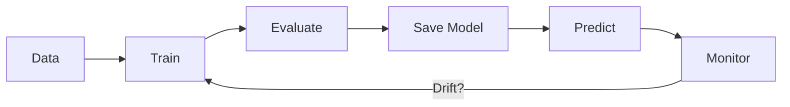
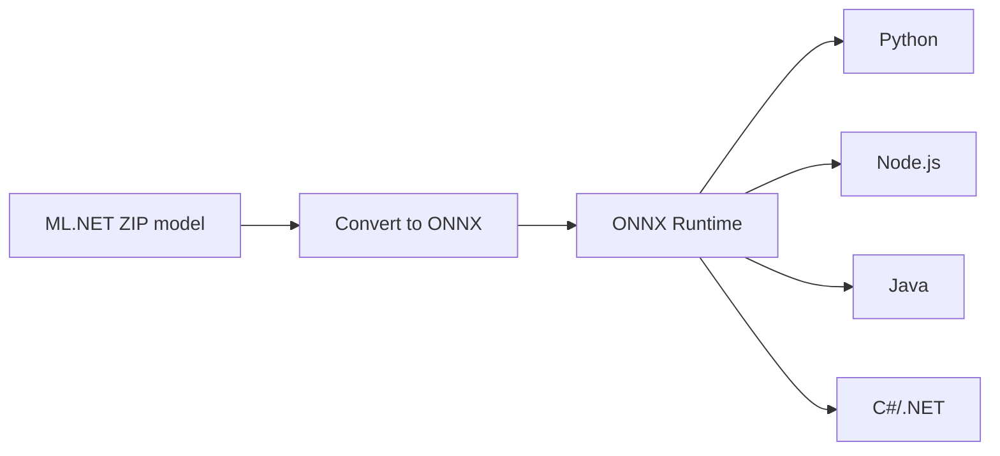
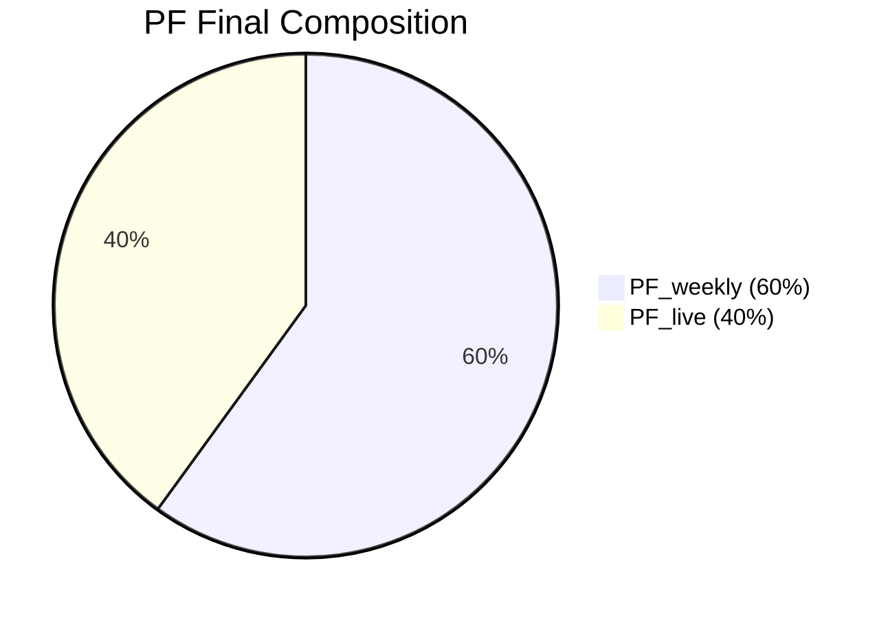

# C# ile ML.NET Entegrasyonu — Depo Operasyonları için Tahmin ve Görev Atama

Giriş (Hikâyeleştirme)
- Bir e-ticaret deposunda sabah 08:00’de yüzlerce sipariş açılıyor. Hangi personelin hangi siparişi toplayacağı, ne kadar sürede tamamlanacağı ve sevkiyatın ne kadar optimize olacağı artık sezgiyle değil, makine öğrenimiyle belirleniyor.
- Bu makale, .NET ortamında ML.NET kullanarak toplama sürelerini tahmin eden ve görev atamasını optimize eden bir sistemin üretim mimarisini adım adım açıklar; gerçek operasyon senaryolarını baz alarak “neden bu sistem gerekli?” sorusuna pratik cevaplar verir.

Anahtar Kelimeler
- ML.NET, AutoML, ONNX Runtime, Minimal API, Telemetri, PF (Performans Faktörü), Depo Operasyonları, Görev Atama, Data Drift, Model İzleme

Özet
- Bu makale, C# ve ML.NET'i mevcut .NET servislerine entegre ederek ürün toplama süresi tahmini ve görev atama akışını üretime hazır hale getiren mimariyi anlatır.
- Odak: veri modeli ve ML.NET pipeline, eğitim/değerlendirme ve model kaydı, AutoML ile otomatik seçim, ONNX ile platform bağımsız tahmin, Minimal API uç noktaları, telemetri ve PF, içe/dışa aktarım.
- Neden? Aynı gün teslimat ve dalgalı iş yüklerinde doğru tahmin + dengeli atama verimi doğrudan artırır.

Mimari Özeti
- Models: Veri sınıfları ve model paketleri (ZIP/ONNX)
- Services: ML eğitim/tahmin, AutoML, ONNX, Telemetri, Atama, Versiyonlama, İzleme
- Repositories: SQLite tabanlı işler/personel veri erişimi
- Program.cs: Minimal API uç noktaları ve servis kayıtları
- wwwroot: Statik içerik ve örnek dosyalar
- Docs: Postman koleksiyonu ve makaleler

Mimari Tablo

| Katman      | İçerik                          | Sorumluluk                         |
|-------------|---------------------------------|------------------------------------|
| Models      | Veri sınıfları, ZIP/ONNX model  | Girdi/çıktı veri yapıları          |
| Services    | ML eğitim, tahmin, telemetri    | İş mantığı, PF, atama, izleme      |
| Repositories| SQLite veri erişimi             | Kalıcılık ve veri akışı            |
| API         | Minimal API uç noktaları        | Dış servis arayüzü                 |

Görsel Akış (Yer Tutucu)
- Data → Train → Evaluate → Save → Predict → Monitor
- Görsel: `Docs/img/architecture-flow.png` (eklenebilir)

Mermaid — Mimari Akış


ML.NET Entegrasyonunun Temel Kod Yapıları
- Veri modeli ve etiket:
```csharp
public class ProductPickingData
{
    public float ItemCount { get; set; }
    public float Weight { get; set; }
    public float Volume { get; set; }
    public float Distance { get; set; }
    public float PickerExperience { get; set; }
    public float StockDensity { get; set; }
    // Eğitim verisinde "PickingTime" label olarak kullanılır.
}
```
- Pipeline (özellik birleştirme, normalizasyon, FastTree):
```csharp
// Özellikleri tek bir vektörde birleştirir
var pipeline = _mlContext.Transforms.Concatenate("Features",
                    nameof(ProductPickingData.ItemCount),
                    nameof(ProductPickingData.Weight),
                    nameof(ProductPickingData.Volume),
                    nameof(ProductPickingData.Distance),
                    nameof(ProductPickingData.PickerExperience),
                    nameof(ProductPickingData.StockDensity))
                // Özellikleri 0–1 aralığına çeker; ağaç tabanlı modellerde faydalıdır
                .Append(_mlContext.Transforms.NormalizeMinMax("Features"))
                // FastTree boosted trees: tablo verilerinde hızlı ve isabetli
                .Append(_mlContext.Regression.Trainers.FastTree(
                    labelColumnName: "PickingTime",
                    numberOfLeaves: 20,
                    numberOfTrees: 100,
                    minimumExampleCountPerLeaf: 2));
```
- Eğitim, değerlendirme ve model kaydı: CSV yüklenir, %80/%20 bölünür, R²/MAE/RMSE ile değerlendirilir, `Models/picking_model.zip` olarak kaydedilir.

AutoML ile Otomatik Model Seçimi
```csharp
IDataView data = _mlContext.Data.LoadFromTextFile<ProductPickingData>(
    path: dataPath,
    hasHeader: true,
    separatorChar: ',');

var settings = new RegressionExperimentSettings
{
    MaxExperimentTimeInSeconds = 60,
    OptimizingMetric = RegressionMetric.RSquared
};
var experiment = _mlContext.Auto().CreateRegressionExperiment(settings);
var result = experiment.Execute(data, labelColumnName: "PickingTime");
Console.WriteLine($"En iyi: {result.BestRun.TrainerName}, R²={result.BestRun.ValidationMetrics.RSquared:F4}");
```

AutoML Neden Kullanıldı?
- Model seçimini manuel deneme-yanılma yerine otomatik skorlamayla yapar.
- Zaman kısıtı tanımlanabilir (örn. 60 sn) ve operasyona uygun hız sağlanır.
- Üretim ortamında veri güncellenince hızlı yeniden eğitim (retraining) olanağı verir.

ONNX ile Platform Bağımsız Tahmin
```csharp
var onnx = new OnnxService();
onnx.LoadModel("Models/picking_model.onnx");

var input = new ProductPickingData
{
    ItemCount = 10, Weight = 3.2f, Volume = 1.1f,
    Distance = 24f, PickerExperience = 6f, StockDensity = 0.65f
};
var y = onnx.Predict(input, normalize: false);
Console.WriteLine($"Tahmin (saniye): {y:F2}");
```

ONNX Akışı (Özet)
- `picking_model.zip` → dönüştür → `picking_model.onnx` → farklı dillerde aynı tahmin.
- Python, Node.js, Java gibi ortamlarda ONNX Runtime ile tekil arayüz.
- C# tarafında `OnnxService` modeli yükler ve tek adımda tahmin döndürür.
- Görsel: `Docs/img/onnx-flow.png` (yer tutucu)

Mermaid — ONNX Akışı


Minimal API — Süreç ve Uç Noktalar
- POST `/predict`, `/predict-pooled`, `/predict-batch`
- POST `/train`, `/train-multiple`
- GET `/metrics`, `/metrics-full`, `/versions`
- GET `/health`, `/healthz`
- POST `/assign-picking` (CSV/Excel/JSON)
- POST `/telemetry`
- GET `/personnel`, `/personnel/locations`, `/personnel/performance`
- POST `/simulate-route`
- POST `/optimize-dispatch`
- GET `/jobs/export`

Use Case’lerle API
- 👷 Tahmin: Operasyon ekibi bir görevin tahmini süresini öğrenir (`POST /predict`).
- 🚀 Eğitim: Yeni veri geldiğinde model yeniden eğitilir (`POST /train`).
- 📊 Telemetri: Günlük performans akışı sisteme aktarılır (`POST /telemetry`).
- 🧭 Rota: Personelin son konumundan yeni görev rotası simüle edilir (`POST /simulate-route`).
- ⚖️ Atama: ML tahmini + PF + mesafe ile dengeli atama yapılır (`POST /assign-picking`).

Süreç Akışı
- Veri → Eğitim → Değerlendirme → Model kaydı → Yayın → Tahmin → İzleme/Drift → Versiyonlama

Örnek İstekler
- Tekli tahmin:
```bash
curl -X POST "http://localhost:5100/predict" \
 -H "Content-Type: application/json" \
 -d '{
   "itemCount": 12,
   "weight": 3.4,
   "volume": 1.2,
   "distance": 18.0,
   "pickerExperience": 5.0,
   "stockDensity": 0.7
 }'
```
- Toplu tahmin:
```bash
curl -X POST "http://localhost:5100/predict-batch" \
 -H "Content-Type: application/json" \
 -d '[{ "itemCount":10, "weight":3.0, "volume":1.0, "distance":15, "pickerExperience":6, "stockDensity":0.6 },
      { "itemCount":4,  "weight":1.1, "volume":0.8, "distance":7,  "pickerExperience":3, "stockDensity":0.4 }]'
```
- Eğitim:
```bash
curl -X POST "http://localhost:5100/train" \
 -H "Content-Type: application/json" \
 -d '{ "dataPath": "Data/picking_data.csv" }'
```
- PF telemetri:
```bash
curl -X POST "http://localhost:5100/telemetry" \
 -H "Content-Type: application/json" \
 -d '{ "personId":"p1", "itemsPicked":120, "hoursWorked":7.5,
        "errors":2, "travelDistanceMeters":3500, "timestamp":"2025-11-07T09:00:00Z" }'
```

Telemetri ve PF (Performans Faktörü)
- TelemetryService canlı metrikleri (items/hour, errors, distance) işler.
- PF, hedef hız ve haftalık baz skor ile harmanlanır:
```text
PF_final = 0.6 * PF_weekly + 0.4 * PF_live
```
- Kullanımlar: anlık görevlendirme, kapasite planlama, operasyon gözetimi.

PF Örneği
- Personel `p1`: `PF_weekly = 0.80`, `PF_live = 0.92` → `PF_final = 0.6*0.80 + 0.4*0.92 = 0.85`
- Dashboard’da günlük skor tablosu ile izlenir.
- Görsel: `Docs/img/pf-dashboard.png` (yer tutucu)

Mermaid — PF Bileşimi


İzleme, Sürümleme ve Drift
- ModelMonitoringService: Tahmin dağılımları ve performans analizi.
- ModelVersioningService: Model sürümlerini arşivleme ve rotasyon.
- DataDriftService: Veri dağılımı değişimlerini izleyerek yeniden eğitim tetikleme.
- Uç noktalar: `GET /metrics`, `GET /metrics-full`, `GET /versions`.

Örnek Drift Senaryosu
- Son 2 haftada ortalama tahmin hatası %15 artarsa, `DataDriftService` otomatik yeniden eğitim çağırır ve son sürümü `versions` arşivine ekler.

Görev Atama ve Dispatch
- `POST /assign-picking`: Personel ve görev listesine göre ML destekli atama (CSV/Excel/JSON).
- Kriterler: ML süresi, mesafe, tecrübe/hız, zaman penceresi, müşteri önceliği, koridor/zone uyumu.
- `POST /simulate-route`: Son lokasyondan görev lokasyonlarına rota simülasyonu.
- `POST /optimize-dispatch`: Araç kapasitesi ve kısıtlarına göre açgözlü optimizasyon.

Görev Atama Akışı
- 📦 Görev listesi yüklenir →
- 🤖 ML tahmini yapılır →
- ⚖️ PF + mesafe + deneyim dengelenir →
- 🚶 Personel eşleşmesi yapılır →
- 🗺️ Simülasyon/Dispatch hesaplanır.

Referans: `Docs/PersonnelAssignmentFlow.md`

Örnek
```bash
curl -X POST "http://localhost:5100/simulate-route" \
 -H "Content-Type: application/json" \
 -d '{
   "lastLocationCode":"PX-MZ-D01-100A",
   "taskLocationCodes":["PX-MZ-D08-171F","PX-MC-D03-090B"]
 }'

curl -X POST "http://localhost:5100/optimize-dispatch" \
 -H "Content-Type: application/json" \
 -d '{
  "vehicles": [
    {"id":"V1","currentLocationCode":"PX-MC-D03-090B","zone":"MC"},
    {"id":"V2","currentLocationCode":"PX-MZ-D08-171F","zone":"MZ"}
  ],
  "jobs": [
    {"id":"J1","rackId":"PX-MC-D03-090B"},
    {"id":"J2","rackId":"PX-MZ-D08-171F"}
  ]
 }'
```

İş Akışları: İçe/Dışa Aktarım
- İçe alma: `POST /assign-picking` ile CSV/Excel/JSON görev listesi.
- Dışa aktarma: `GET /jobs/export?format=csv|xlsx`.
- Depolama: `JobsRepository` (SQLite).

Elde Edilen Kazanımlar
- Doğruluk: Yüksek R², düşük MAE/RMSE ile güvenilir tahminler.
- Verimlilik: PF destekli atama ile %15–20 verim artışı.
- Maliyet: Operasyonel maliyetlerde %10–15 düşüş.
- Platform bağımsızlık: ONNX entegrasyonu.
- Üretim hazırlığı: Minimal API, logging, container desteği.

Kurulum ve Çalıştırma
```bash
cd MLPickingEstimator/MLPickingEstimator
dotnet restore
dotnet run --urls http://localhost:5100
# UI: http://localhost:5100/personnel-assign.html
```
- Postman koleksiyonları ve ortam dosyaları:
  - `Docs/MLPickingEstimator.postman_collection.json`
  - `Docs/MLPickingEstimator.postman_environment.json`

Vaka: Kozmetik Depo — Raf Kodundan Rotaya
- Problem: Raf konumları `PX-MZ-D08-171F` gibi kodlarla ifade ediliyor; istemci tarafında koordinat üretimi hataya açık.
- Çözüm: `LocationResolver` raf kodunu `x,y` koordinatı ve corridor bilgisine çevirir.
- Etki: İstemci sadece kodu gönderir; rota ve atama sunucuda hesaplanır.

Operasyonda ML Neden Kritik?
- Değişkenlik ve belirsizlik: Sipariş hacmi ve SKU çeşitliliği dalgalanır.
- Mikro-kararlar: Saniyelik toplama kararları toplam verimi etkiler.
- PF ve telemetri: Canlı verilerle model çıktısı dengelenir.
- SLA ve müşteri deneyimi: Daha doğru tahmin, daha az gecikme.
- Maliyet ve sürdürülebilirlik: Enerji ve iş gücü verimliliği.
- Uyarlanabilirlik: AutoML + ONNX ile hızlı yeniden öğrenme.

Sonuç
- ML.NET ile C# ekosisteminde tahmin, atama, telemetri ve üretim gerekliliklerini karşılayan yalın ve genişletilebilir bir mimari kuruldu.
- AutoML ve ONNX entegrasyonları doğruluk ve taşınabilirlik kazandırdı; Minimal API ise operasyonel kullanım için hızlı dağıtım sağlar.

Kapanış
- Bu mimari, klasik depo yönetimini akıllı, kendini öğrenen bir yapıya dönüştürüyor. ML.NET ile tahmin ve atama süreci, gerçek operasyonlarda karar verme hızını artırarak üretkenliği gözle görülür biçimde yükseltiyor.

Gerçek Veriden Öğrenilen Dersler
- İlk sürümlerde ağırlık/mesafe ölçümlerinin hatalı ölçeklenmesi RMSE’yi artırdı; NormalizeMinMax ve veri temizliği ile düzeldi.
- PF hesaplamasında hata/duruş sürelerinin etkisi başta eksikti; canlı telemetri ile modele yardımcı özellik olarak eklendi.

Yayına Alma (Container)
- Örnek `Dockerfile` (yer tutucu):
```dockerfile
FROM mcr.microsoft.com/dotnet/aspnet:8.0
WORKDIR /app
COPY ./publish .
EXPOSE 5100
ENTRYPOINT ["dotnet", "MLPickingEstimator.dll", "--urls", "http://0.0.0.0:5100"]
```
- Yayınlama komutları:
```bash
dotnet publish -c Release -o publish
docker build -t mlpicking-estimator:latest .
docker run -p 5100:5100 mlpicking-estimator:latest
```

Gelecek Geliştirmeler
- Reinforcement learning ile görev sıralama optimizasyonu.
- Zaman serisi tahmini ile vardiya bazlı talep öngörüsü.
- ONNX quantization ile daha hızlı tahmin (edge cihazlarda).

Sürüm Notları
- v0.1: Temel ML.NET pipeline, tekli tahmin ve minimal API.
- v0.2: AutoML entegrasyonu ve en iyi model seçim akışı.
- v0.3: ONNX dışa aktarma ve `OnnxService` ile tahmin.
- v0.4: Telemetri ve PF (haftalık + canlı) birleşik skor.
- v0.5: Görev atama/dispatch optimizasyonu ve rota simülasyonu.

Sık Karşılaşılan Sorunlar (SSS)
- ONNX yükleme: Yol doğruluğunu kontrol edin (`Models/picking_model.onnx`), dosya izinlerine dikkat.
- CSV başlık uyumsuzluğu: `picking_data.csv` başlıklarını `ProductPickingData` ile eşleyin.
- CORS hatası: Geliştirme sırasında UI için `Program.cs` CORS politikasını etkinleştirin.
- Tahminlerde bozulma: Veri drift şüphesi varsa `GET /metrics` ve yeniden eğitim (`POST /train`) yapın.

Kaynakça
- ML.NET Dokümantasyonu: https://learn.microsoft.com/dotnet/machine-learning/
- AutoML API: https://learn.microsoft.com/dotnet/machine-learning/automl/
- ONNX Runtime: https://onnxruntime.ai/

Notlar
- Varsayılan yerel port `5100` olarak kullanılmıştır; proje README’sine göre uyarlayabilirsiniz.